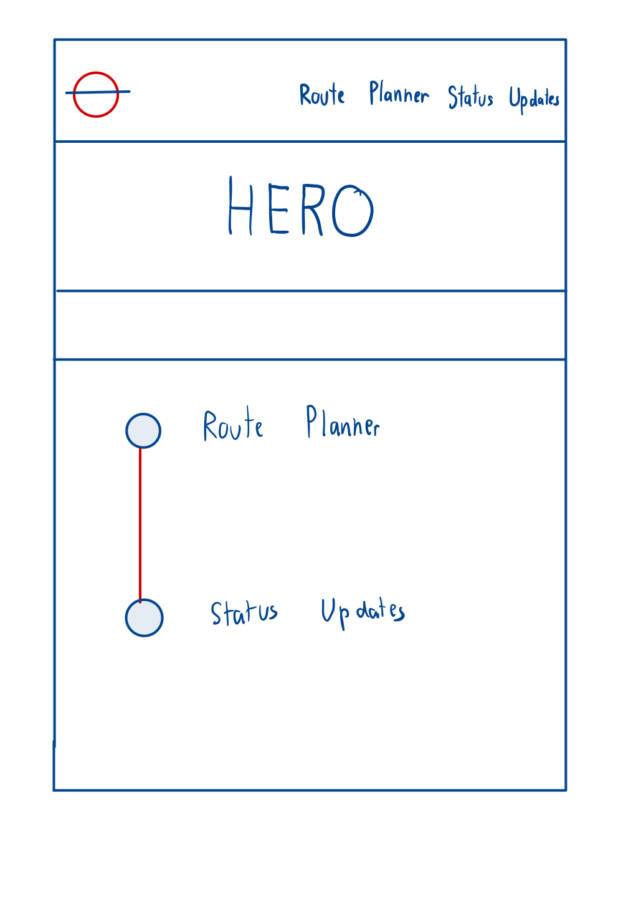
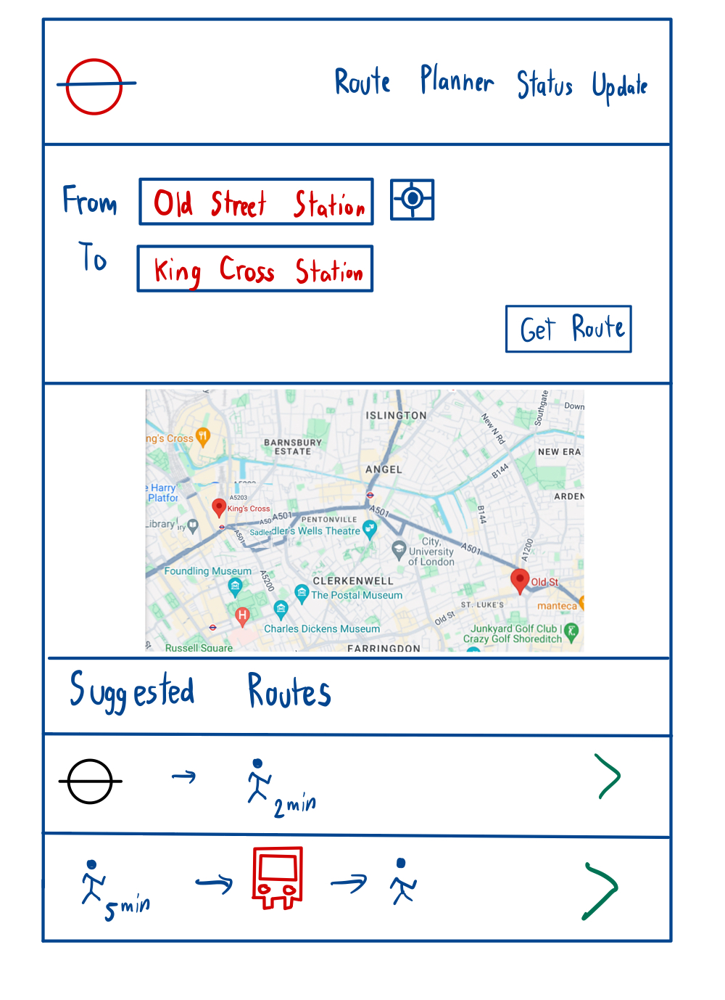
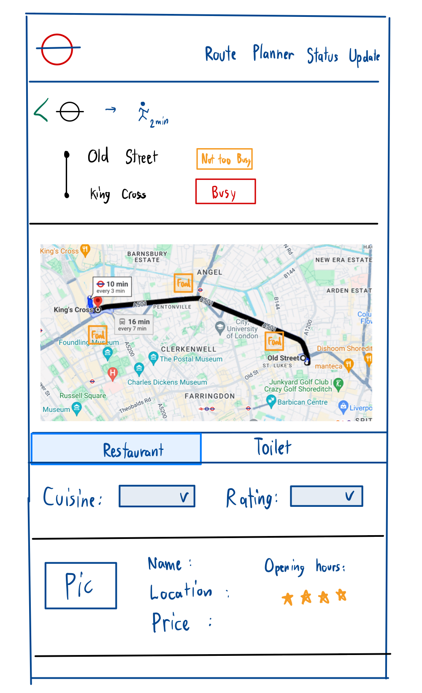
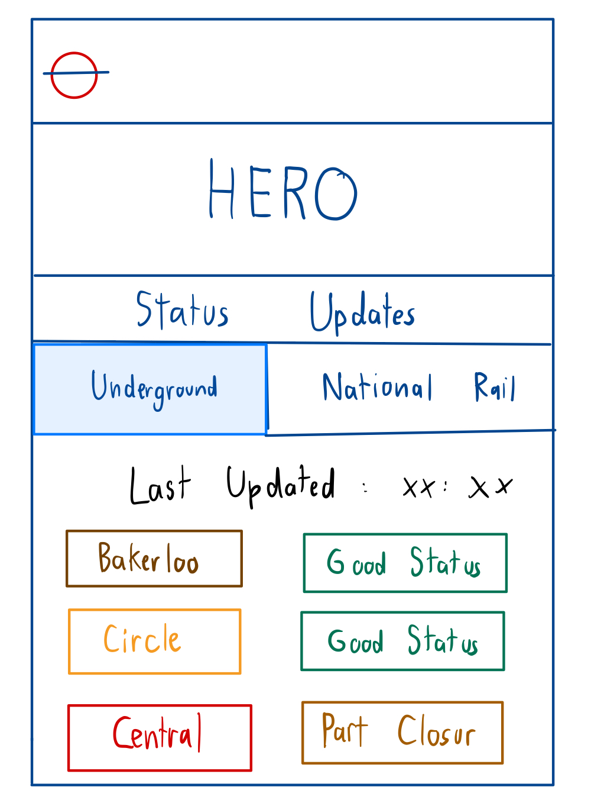

# Project Title

Mind the Map

## Overview

Mind the Map is your travel companion for London! Whether you're a visitor or resident, easily plan the route, find nearby restaurants and toilets. Plus, stay updated on tube and national rail statuses for smooth travels.

### Problem

London's visitors often struggle to navigate the city efficiently, searching for the best routes to reach their destinations while also needing to pause at restaurants or toilets along the way. Similarly, residents face these same issues in their daily routines. This app is designed to tackle theses common issues.

### User Profile

Residents and visitor of London. Residents use it for their daily commutes, while visitors rely on it for navigating the city's attractions

### Features

Route Planning:

- Users can input their starting point and destination point to find the best route options
- Provide multiple route options if available, allowing users to choose based on preferences
- Displays detailed information about each route, including distance, estimated time, and transportation modes

Status Updates:

- Users can view the real-time status of various transportation lines, including tubes and national rail trains.
- Status information should include details such as delays, disruptions.

Toilet Facilities Locator:

- Users can discover for nearby toilet facilities along the routes.
- Display relevant information such as accessibility
- Users can filter restaurants based on preferences.

Restaurant Recommendations:

- Users can discover for nearby restaurants along the routes.
- Provide details such as average cost and ratings.
- Users can filter restaurants based on preferences such as ratings.

## Implementation

### Tech Stack

- React.js
- Git
- Cors
- Axios

### APIs

#### Tranport for London (TfL) API - Journey Planner

Allows users to plan their journeys using London's public transportation network. The API returns detailed route information.

#### Travel Advisor API - Restaurant

Allows users to discover nearby restaurants along the routes.

#### MapBox API - Searchbox, Map, Marker, Route

Allows users to specify starting point and destination of the route while also displaying markers representing restaurants and public bathrooms, as well as routes for their planned journeys.

#### Public Bathrooms API

Allows users to discover nearby toilets along the routes.

### Sitemap

- Home
- Route Planner
- Status Updates

### Mockups

#### Home Page



#### Route Planner Page



#### Route Planner (Selected) Page



#### Status Updates Page



### Data

## Roadmap

#### Sprint 1: Setting Up Basic Project Structure

- Initialize Git repository and set up project structure.
- Set up front-end side and create basic components.
- Set up initial server structure.
- Implement authentication endpoints on the server side.

#### Sprint 2: Home Page

- Design and develop the home page layout.
- Implement router functionality.

#### Sprint 3: Route Planner

- Design and develop the user interface for the route planner.
- Implement functionality for users to input their starting point and destination to plan routes.
- Implement functionality to generate and display route options based on user inputs.
- Develop functionality for users to view details of selected routes, including distance, estimated time, and transportation modes.

#### Sprint 4: Selected Route

- Design and develop the user interface for the selected route.
- Implement functionality to generate and display route details.
- Implement functionality to display the route on the map

#### Sprint 5: Restaurant

- Design and develop restaurant list user interface.
- Integrate restaurants API.
- Implement functionality for users to filter the restaurants based on preferences.
- Implement functionality to show the filtered list of restaurants.
- Implement functionality for users to choose the restaurant and see the detail.
- Implement functionality to show the restaurant marker on the map

#### Sprint 5: Toilet

- Design and develop toilet list user interface.
- Integrate toilets API.
- Implement functionality for users to filter the toilets based on preferences.
- Implement functionality to show the filtered list of toilets.
- Implement functionality for users to choose the toilet and see the detail.
- Implement functionality to show the toilet marker on the map

#### Sprint 5: Status Updates

- Design and develop status updates user interface.
- Implement functionality to fetch and display updates on underground and national rail statuses.
- Configure auto-refresh functionality to automatically update the status.

## Nice-to-haves

### Endpoints

**POST /user/register**

Parameters:

- username: User's username
- name: User's full name
- password : User's password
- email : User's email address

**POST /user/login**

Parameters:

- email: User's email address
- password: User's password

Example Response:

```javascript
{
"success": true,
"token": "eyJhbGci....",
"user": {
    "id": "1",
    "username": "user",
    "name": "John Doe",
    "email": "john@example.com"
  }
}
```

**POST /bookmark**

Parameters:

- userId: ID of the user bookmarking the route
- routeId: ID of the route being bookmarked

**GET /user/profile**

Parameters:

- userId: ID of the user bookmarking the route
- routeId: ID of the route being bookmarked

Example Response:

```javascript
{
"id": "1",
"username": "user",
"name": "John Doe",
"email": "john@example.com",
"bookmarks": [
    {
        "routeId": "12",
    },
    {
        "routeId": "13",
    }
  ]
}
```

### Auth

JWT

### List of Nice-to-haves

- Restaurant Page: Find nearby restaurants at specific location without needing to access the route planner page.
- Toilet Page : Find nearby toilets at specific location without needing to access the route planner page
- Reviews and Ratings: Users can write reviews and leave ratings of restaurant, pub, and toilet.
- Save routes: Users can save the routes directly to their local device in PDF or JPG format.
- Badge: Users will recieve a badge for exploring new areas in London.
