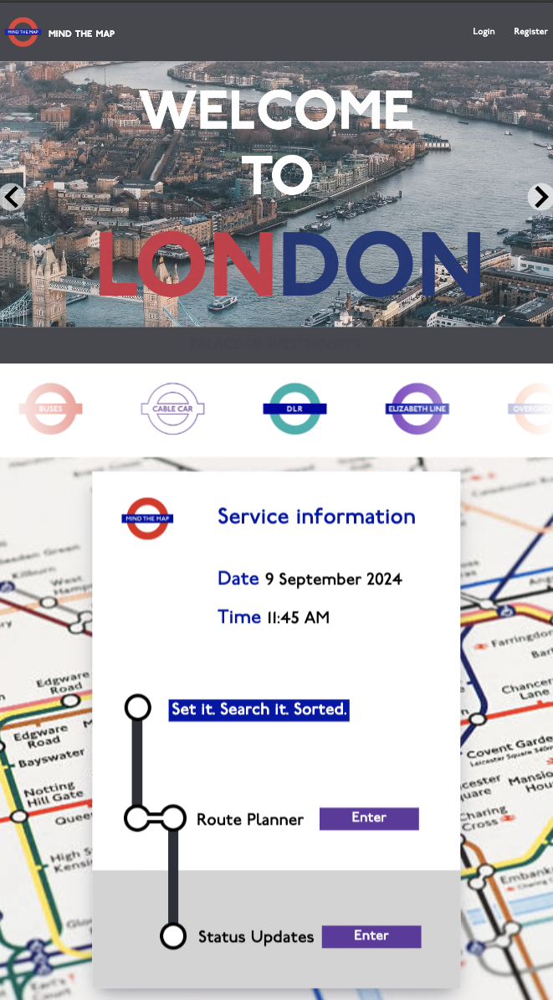
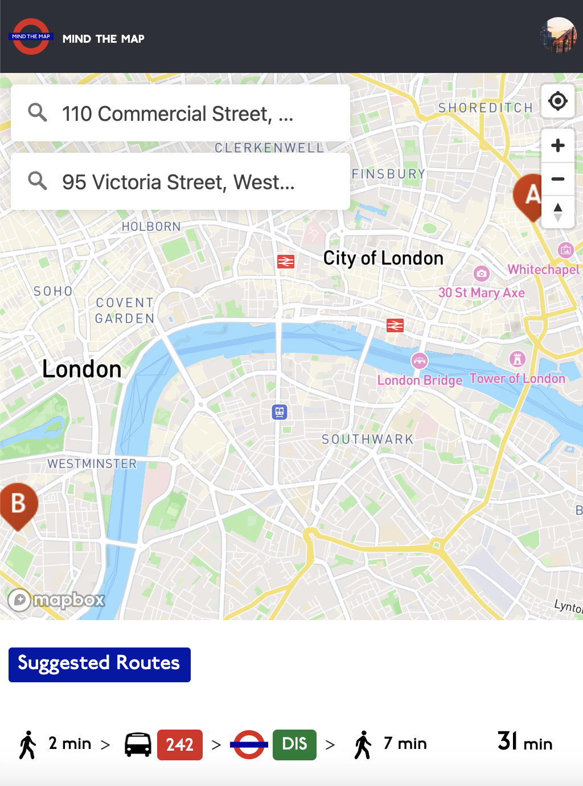
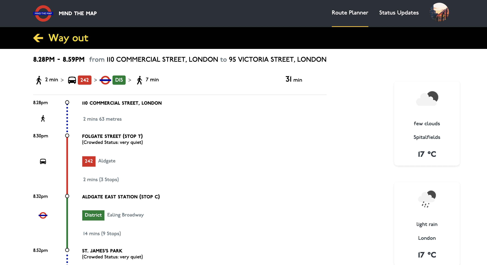
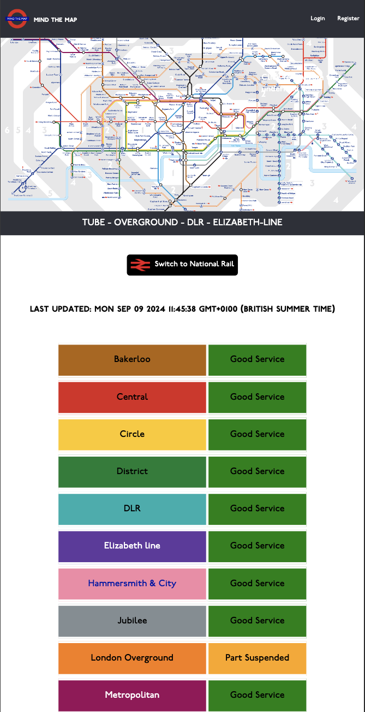

# Project Title

Mind the Map

## Website

You can explore the full **Mind the Map** experience online by visiting the following link: [Mind the Map](https://www.mind-the-map.london/). To try out all the features without signing up, feel free to use the following credentials:

- **Email**: `johndoe@hotmail.com`
- **Password**: `aA12345!`

Enjoy your exploration of the site!

## Installation

1. Clone the repository of client [Mind the Map](https://github.com/tnp167/mind-the-map) and server [Mind the Map Server](https://github.com/tnp167/mind-the-map-server)

```bash
git clone https://github.com/tnp167/mind-the-map.git
git clone https://github.com/tnp167/mind-the-map-server.git
```

2. Install all package dependencies on both the client and server

```bash
//For the client
cd mind-the-map
npm install
```

```bash
//For the server
cd mind-the-map-server
npm install
```

3. Set up a PostgreSQL database. Refer to your database provider's documentation for creating a database.

Apply the database migrations to set up the schema:

```bash
//For the server
npm run migrate
```

Populate the database with initial data:

```bash
//For the server
npm run seed
```

4. Create .env file (using .env.sample as a referenece) and provide the necessary values

5. Launch the application for both client and server sides

```bash
//For the client
cd mind-the-map
npm run start
```

```bash
//For the server
cd mind-the-map-server
npm run start
```

## Overview

Mind the Map is your travel companion for London! Whether you're a visitor or resident, easily plan the route, find nearby restaurants and toilets. Plus, stay updated on tube and national rail statuses for smooth travels.

### Problem

London's visitors often struggle to navigate the city efficiently, searching for the best routes to reach their destinations while also needing to pause at restaurants or toilets along the way. Similarly, residents face these same issues in their daily routines. This app is designed to tackle theses common issues.

### User Profile

Residents and visitor of London. Residents use it for their daily commutes, while visitors rely on it for navigating the city's attractions

### Features

**Route Planning**:

- Users can input their starting point and destination point to find the best route options
- Provide multiple route options if available, allowing users to choose based on preferences
- Displays detailed information about each route, including distance, estimated time, and transportation modes

**Status Updates**:

- Users can view the real-time status of various transportation lines, including tubes and national rail trains.
- Status information should include details such as delays, disruptions.

**Weather information**:

- Users can view weather updates for both the starting point and the destination of their route.

**Restaurant Recommendations**:

- Users can discover for nearby restaurants along the routes.
- Provide details such as average cost and ratings.
- Users can filter restaurants based on ratings.

**Toilet Facilities Locator**:

- Users can discover for nearby toilet facilities along the routes.
- Display relevant information such as accessibility
- Users can filter restaurants based on preferences.

**Register / Login / Logout**:

- Users can create an account to access saved routes features.
- Registered users can log in to the website to access their profile and saved routes.
- Users can securely log out of their accounts.

**Edit Profile**:

- Logged-in users can update their first name, last name, and username.
- Users can upload picture to change their avatar picture.

**Saved Routes**:

- Logged-in users can save their preferred routes for future reference.
- Users can rename any saved route.
- Users can delete routes that they no longer need.
- Users can select a saved route and automatically navigate to the route planner with the route pre-loaded.

**Tourist attraction links**:

- Users can easily set their destination to a popular tourist attraction by clicking on the desired image from a provided slideshow of attractions.

## Implementation

### Tech Stack


### External APIs


#### Tranport for London (TfL) API - Journey Planner, Line status

Allows users to plan their journeys using London's public transportation network.
Display the current status of Tube and National Rail lines.

#### MapBox API - Searchbox, Map, Marker, Route

Allows users to specify starting point and destination of the route while also displaying markers representing restaurants and public bathrooms, as well as routes for their planned journeys.

#### Travel Advisor API - Restaurants

Allows users to discover nearby restaurants along the routes.

#### Public Bathrooms API - Toilets

Allows users to discover nearby toilets along the routes.

#### Openweather API - Weather

Allows users to view weather updates for both the starting point and the destination of their routes.

### Sitemap

- Home
- Route Planner
- Status Updates

### Website Preview

#### Home Page



#### Route Planner Page



#### Route Planner (Selected) Page




#### Status Updates Page



## Disclaimer

This repository is an independent project and is **not** affiliated with, endorsed by, or officially connected to Transport for London (TfL) or its parent organization, Greater London Authority (GLA). All names, logos, and trademarks related to TfL and GLA are the property of their respective owners.
